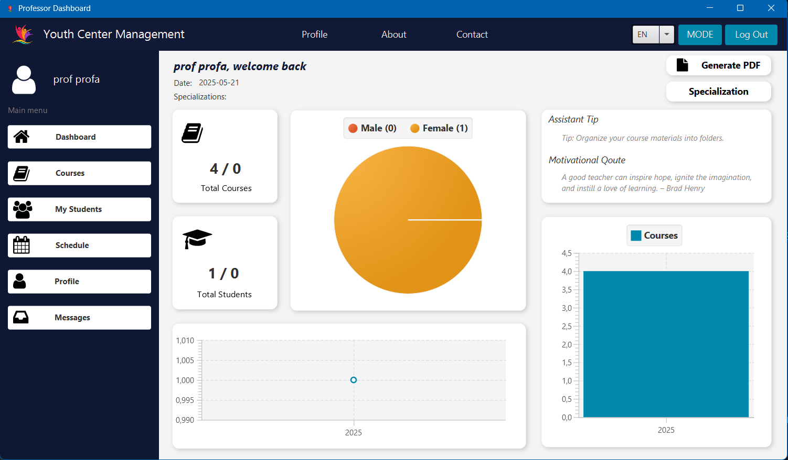
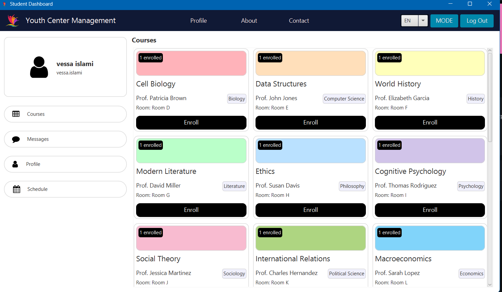
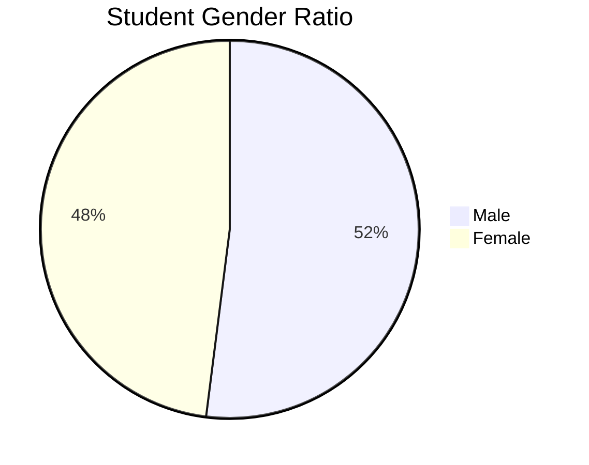

<h1 align="center" id="top">Youth Academy Management System</h1>

<div align="center">


</div>

## Table of Contents
- [👩‍💻 User Guide](#-user-guide)
- [🌟 Key Features](#-key-features)
- [🖥️ Screenshots](#️-screenshots)
- [⚙️ Technical Implementation](#️-technical-implementation)
- [🚀 Installation](#-installation)
- [📊 Analytics](#-analytics)
- [🔐 Security](#-security)

---

## 👩‍💻 User Guide

### 🎯 For Students
1. **Login**
    - Use your student ID and password
    - First-time users: Click "Forgot Password" to set up

2. **View Schedule**
   ```plaintext
   Dashboard → My Schedule (auto-updates when you enroll)

3. **Earn Badges**
 - Perfect Attendance: Attend all classes for 1 month
 - Top Performer: Score >90% in 3 consecutive activities

4. **Update Profile**
```plaintext
Profile → Change contact info → Save
```
5. Switch Dark Mode
```plaintext
Mode → Toggle Dark/Light
```
### 👨‍🏫 For Professors

1. Verify Students
```plaintext
Students Tab → Verify → accept/decline
```

2. View Daily Tips
- Motivational quotes appear on your dashboard daily
- Teaching tips refresh every 24 hours

3. Check Analytics
```plaintext
Analytics → Gender Distribution / Enrollment Trends
```

4. Message Students
```plaintext
Inbox → New Message → Select student → Send
```

## 🌟 Key Features

### 🎓 Student Features
- Personalized dynamic schedules
- Achievement badges (Perfect Attendance, Top Performer)
- Profile management with dark/light mode
- Cross-platform messaging

### 👨‍🏫 Professor Features
- Daily randomized teaching tips and quotes
- Student verification system
- Gender distribution analytics
- Course enrollment charts

### ⚙️ System Features
- Bilingual UI (English/Albanian)
- Advertisement slots on login
- Automated email notifications
- JWT authentication

---

## 🖥️ Screenshots
|  |  |
|-------------------------------------------------------|---------------------------------------------|
| Professors Dashboard                                  | Students Courses View                       |

---

## 📊 Analytics

### Gender Distribution
A pie chart illustrating the student gender ratio.


    
    

### Enrollment Trends
The enrollment trends are visualized using a JavaFX controller for dynamic data rendering.

**Java Code**:
```java
// Enrollment statistics controller
@FXML
private void initializeEnrollmentChart() {
    enrollmentChart.getData().add(
        statsService.getEnrollmentTrends()
    );
}
```

## 🔐 Security

### Verification Flow
The system ensures secure student verification through a mutual approval process:
1. Professor requests student verification.
2. Student receives notification.
3. Mutual approval required.
4. System logs verification event.

### Password Management
Passwords are securely hashed using SHA-256 with a salt for enhanced security.

**Java Code**:
```java
public String hashPassword(String password, String salt) {
    String saltedPass = salt + password;
    return DigestUtils.sha256Hex(saltedPass);
}
```

## 🤝 Contributing
We welcome contributions to the Youth Academy System! Follow these steps to contribute:

1. **Fork the project**.
2. **Create your feature branch**:
   ```bash
   git checkout -b feature/new-badge-type
   ```
3. **Commit your changes**:
   ```bash
   git commit -m "Add leadership badge"
   ```
4. **Push to the branch**:
   ```bash
   git push origin feature/new-badge-type
   ```
5. Open a pull request on the [GitHub repository](https://github.com/erikbehrami/Youth_Academy_System).

<div align="center">
📧 **Contact**: erik.behrami@example.com  
🔗 **Project Link**: [https://github.com/erikbehrami/Youth_Academy_System](https://github.com/erikbehrami/Youth_Academy_System)
</div>
```

<a href="#top">Go to top</a>

